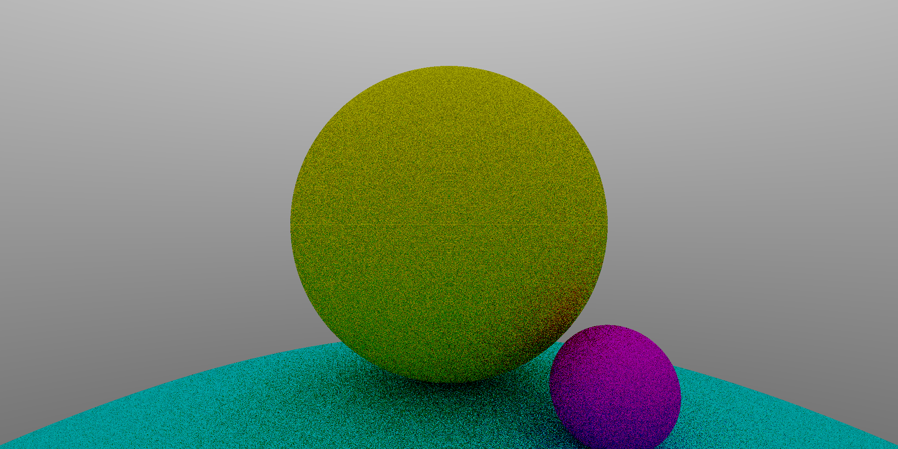

# Rayskell

A minimal ray tracer program, written in Haskell, and used for a short presentation about Ray Tracing that I gave in Somerville College, Oxford. (Which is why I used Haskell LoL, IYKYK)

## Building & Running
run
```shell
ghc --make RayTracer.hs -main-is RayTracer -o ray
./ray
```
Tested on Windows Subsystem for Linux and macOS. Doesn't work on Windows (my Haskell installation in Windows says it cannot find the "System.Random" package, somehow)

The generated image file is in .ppm format. In windows, you need to install an app to view it. In macOS, the buit-in preview app should do.

## References
Ray Tracing in a Weekend

## Results
